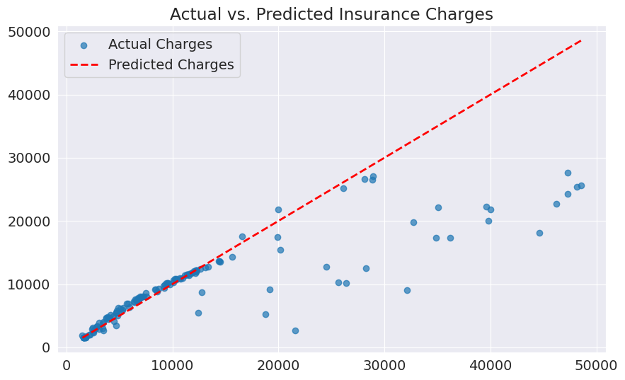

# Insurance Cost Prediction using Linear Regression

This project predicts yearly medical insurance costs based on personal attributes like age, sex, BMI, number of children, and smoking habits. This model can be valuable for insurance companies in determining annual insurance premiums. The dataset used for this project is from [Kaggle](https://www.kaggle.com/mirichoi0218/insurance).

## Project Steps

1.  **Data Exploration and Preprocessing:**
    *   Loaded the dataset using pandas.
    *   Analyzed the data to understand its structure, including the number of rows and columns.
    *   Identified categorical and numerical features.
    *   Visualized the distribution of the target variable, "charges," and applied a log transformation to handle its skewed distribution.
    *   Converted categorical features into numerical representations.

2.  **Data Preparation for Training:**
    *   Converted the pandas DataFrame into NumPy arrays and then into PyTorch tensors.
    *   Created a `TensorDataset` to handle the data.
    *   Split the dataset into training and validation sets.
    *   Created `DataLoaders` to efficiently load data in batches during training.

3.  **Linear Regression Model:**
    *   Defined a custom `InsuranceModel` class that inherits from `nn.Module`.
    *   The model consists of a single linear layer that maps the input features to the output (predicted charges).
    *   Implemented training and validation steps within the model, using Mean Absolute Error (L1 Loss) as the loss function.

4.  **Model Training:**
    *   Developed a `fit` function to handle the training loop.
    *   Trained the model for multiple epochs with varying learning rates to find the optimal hyperparameters.
    *   Monitored the validation loss to prevent overfitting and assess the model's performance.

5.  **Prediction and Evaluation:**
    *   Made predictions on the validation set using the trained model.
    *   Evaluated the model's performance using the R-squared (R²) score, which measures the proportion of the variance in the dependent variable that is predictable from the independent variable(s).
    *   Visualized the actual vs. predicted charges against BMI to understand the model's predictive power.

6.  **Saving and Loading the Model:**
    *   Saved the trained model's state dictionary to a file.
    *   Demonstrated how to load the saved model for future use.

## Results

After training, the model achieved a validation loss of approximately 2563.68 and an R-squared score of 0.5990. The predictions, while not perfect, show a reasonable correlation with the actual insurance charges.

## How to Run the Code

1.  Ensure you have the required libraries installed: `torch`, `pandas`, `matplotlib`, `seaborn`, and `scikit-learn`.
2.  Download the `insurance.csv` dataset from the provided Kaggle link.
3.  Run the Jupyter Notebook cells in sequence to reproduce the results.
